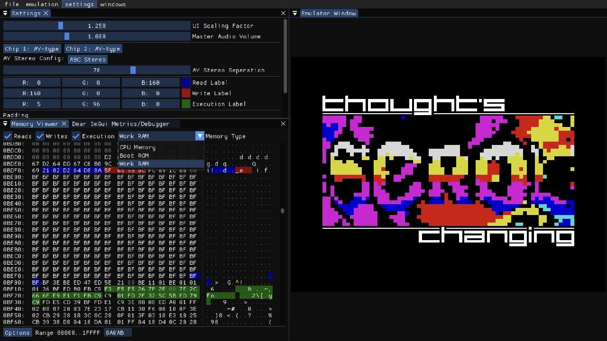

# aartZX
a modern ZX Spectrum emulator in C, C++, SDL2 and Dear ImGui

## features

- ayumi AY sound emulation with TurboSound 2xAY support!
- Modular interface using Dear ImGui
- Memory Debugger with customizable Read/Write/Execution labels!
- Customizable AY stereo settings
- open-source the zlib license.

## legal
This emulator is distributed under the zlib license shown here:

> Copyright (c) 2025 AnnoyedArt1256
> 
> This software is provided 'as-is', without any express or implied
> warranty. In no event will the authors be held liable for any damages
> arising from the use of this software.
> 
> Permission is granted to anyone to use this software for any purpose,
> including commercial applications, and to alter it and redistribute it
> freely, subject to the following restrictions:
> 
> 1. The origin of this software must not be misrepresented; you must not
>    claim that you wrote the original software. If you use this software
>    in a product, an acknowledgment in the product documentation would be
>    appreciated but is not required.
> 2. Altered source versions must be plainly marked as such, and must not be
>    misrepresented as being the original software.
> 3. This notice may not be removed or altered from any source distribution.
